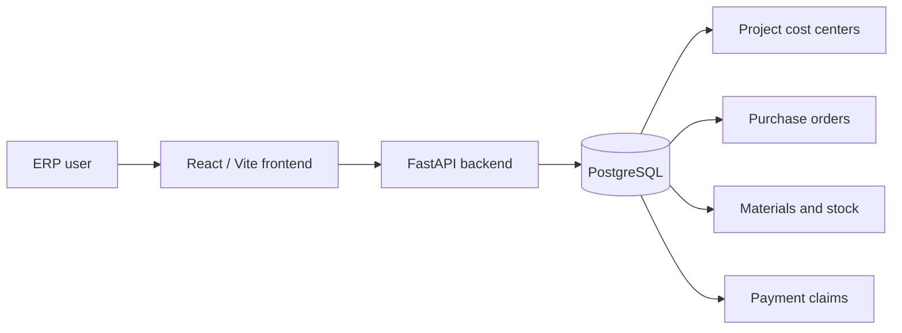
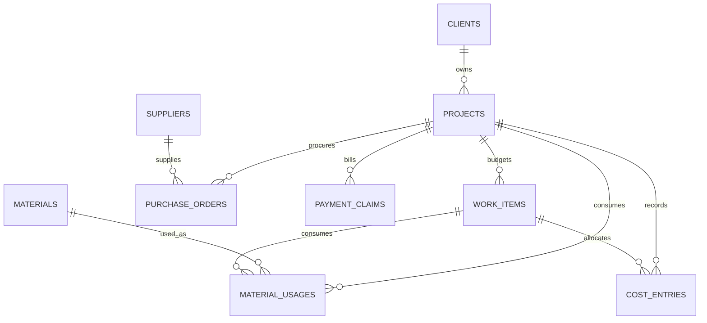
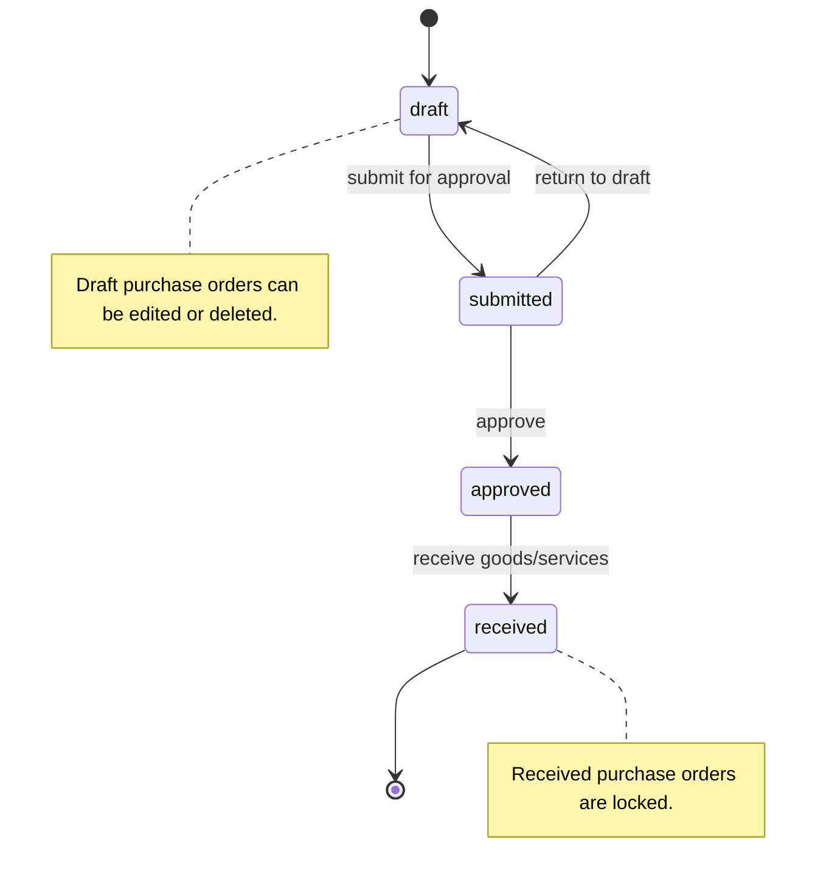
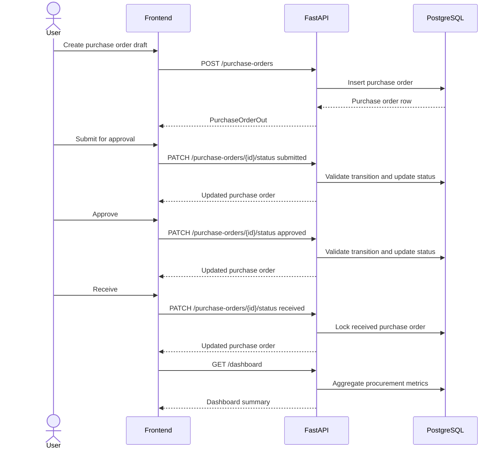
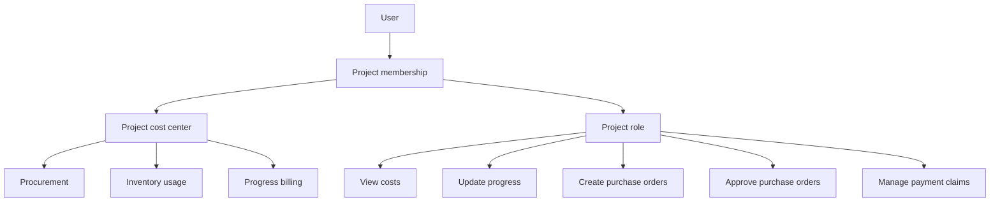

# Diagrams

This document keeps project diagrams close to the codebase so workflow and architecture changes can be reviewed with normal commits.

## System Context

## Project Cost Center Model

## Procurement Status Flow

## Procurement Sequence

## Future Access Model

## Suggested Diagram Backlog

- Material receiving and job-site usage flow.
- Progress billing status flow.
- Authentication and project membership sequence.
- Future permission model before adding external authorization tools.
